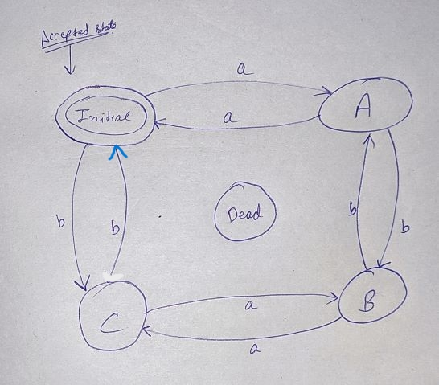

# [Program 9](program9.l)

Design a DFA in LEX Code which accepts string containing even number of `a` and even number of `b` over input alphabet `{a, b}`.

## How to implement DFA in LEX Code?

1. Make DFA for the given condition.



2. write decaration section of LEX Code.
```c
%{
%}
```
3. now write all node name in LEX Code except INITIAL node this is bydefalut provided by LEX.

```c
%s A B C DEAD

```
4. Now write all actions rule for each node , i.e. what to do when particular character is read from input string.

- if string is : `aabb`, then flow will be(see dfa diagram) :
    - A -> A -> C -> C -> INITIAL
    - here last node is INITIAL node (i.e. final node)
    - so string is accepted by DFA
- if string is : `ab`, then flow will be :
    - A -> B
    - here last node is B node (i.e. not final state)
    - so string is not accepted by DFA

5. How to write action rule for each node

- syntax: `<NODE NAME>char_read    corresponding_action;`
- eg: if current node is `A` and char read is `b`, and we have to go to node `C`, then code will be :
- `<A>a BEGIN C;`

6. Now code is ready to be compiled and run.


## Final Code with Explanation
NOTE: refer diagram for code.
```c

%{

%}
// declare all node name in LEX Code
%s A B C DEAD

// now write rules for each node
// note : \n means string is completed
%%
// INITIAL node
<INITIAL>\n printf("Accepted\n"); BEGIN INITIAL;    // final node so print (string is accepted) and reset DFA to INITIAL node
<INITIAL>a BEGIN A; // when a is read goto node A
<INITIAL>b BEGIN C; // when b is read goto node C
<INITIAL>[^ab\n] BEGIN DEAD; // when any other character is read goto DEAD node

// A node
<A>a BEGIN INITIAL;
<A>b BEGIN B;
<A>[^ab\n] BEGIN DEAD;
<A>\n printf("Rejected\n"); BEGIN INITIAL; // when there is no more character in string then print (string is rejected) and reset DFA to INITIAL node

// B node
<B>a BEGIN C;
<B>b BEGIN A;
<B>[^ab\n] BEGIN DEAD;
<B>\n printf("Rejected\n"); BEGIN INITIAL;

// C node
<C>a BEGIN B;
<C>b BEGIN INITIAL;
<C>[^ab\n] BEGIN DEAD;
<C>\n printf("Rejected\n"); BEGIN INITIAL;

// DEAD node
<DEAD>. BEGIN DEAD;
<DEAD>\n printf("Rejected\n"); BEGIN INITIAL;

%%


int yywrap(){
    return 1;
}

int main(){
    yylex();
    return 0;
}
```
[click here for code](./program9.l)

Some Important Points:
- always see the diagram for code
- `\n` means end of string
- for all `final node` on reading `\n`, print `(string is accepted)`
- for all `non final nodes` on reading `\n`, print `(string is rejected)`
- reset DFA to INITIAL node (this is for reading new string)